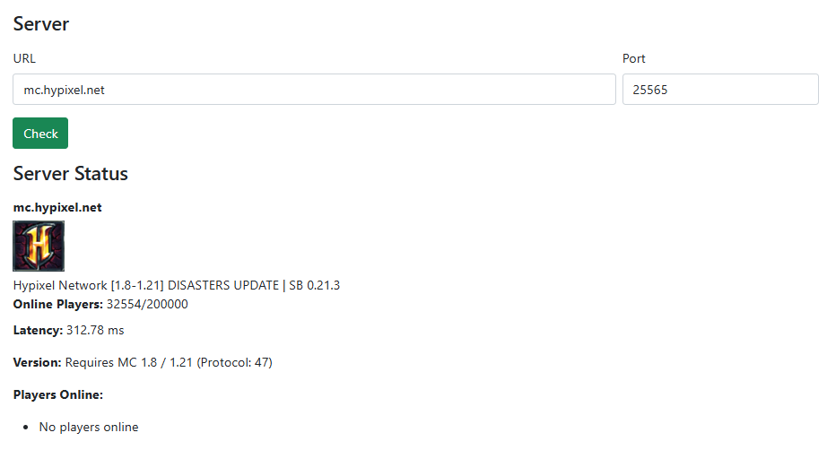

# Minecraft Server Status Checker

A simple, responsive web tool to check the real-time status of any Minecraft server. Built using **HTML**, **Bootstrap**, **jQuery**, and powered by the [MineTools API](https://api.minetools.eu/).

## **Live Website** 👀
- [Live Website](https://velimirpaleksic.github.io/minecraft-server-status-checker/)


## **Features**
- Check Minecraft server availability and status.
- Displays:
  - Server description
  - Latency (ping)
  - Server version and protocol
  - Player count and player list
  - Server favicon (if available)
- Pre-filled example server (`mc.hypixel.net`).

## **How to Use**

1. **Clone or Download the Repository**
```bash
git clone https://github.com/velimirpaleksic/minecraft-server-status-checker.git
```

2. **Files included:**
   - `index.html` — Main HTML file.
   - `bootstrap.css` — Bootstrap stylesheet.
   - `jquery.js` — jQuery library.
   - `pack.png` — Default server image.

3. **Open `index.html` in your browser.**

4. **Usage:**
   - Enter the Minecraft server URL (e.g., `mc.hypixel.net`).
   - Enter the port (default is `25565`).
   - Click **Check**.
   - Server status, player info, and version details will be displayed.

## **API Used**
- [MineTools API - `/ping/{server}/{port}`](https://api.minetools.eu/)

## **Dependencies**
- [Bootstrap](https://getbootstrap.com/)
- [jQuery](https://jquery.com/)

## **Customization**
- You can easily change the default server or styles by editing:
  - The default values in the `<input>` fields inside `index.html`.
  - The CSS by modifying `bootstrap.css` or adding custom styles.

## **License**
This project is open source under the [MIT License](LICENSE).

## **Contact** ✉
- E-mail: [velimir.paleksic@gmail.com](velimir.paleksic@gmail.com).
- VexSystems GitHub: [github.com/vexsystems](https://github.com/vexsystems).
- VexSystems Instagram: [@vex.systems](https://www.instagram.com/vex.systems/).